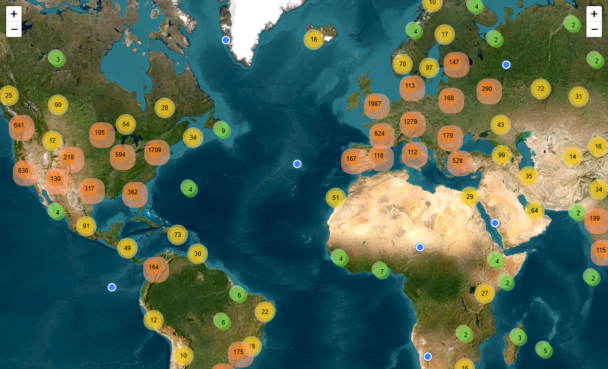
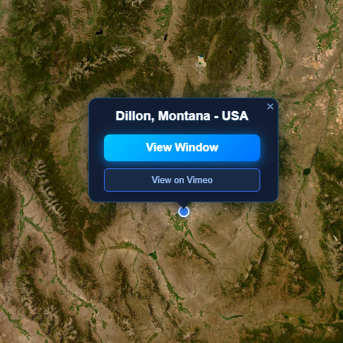
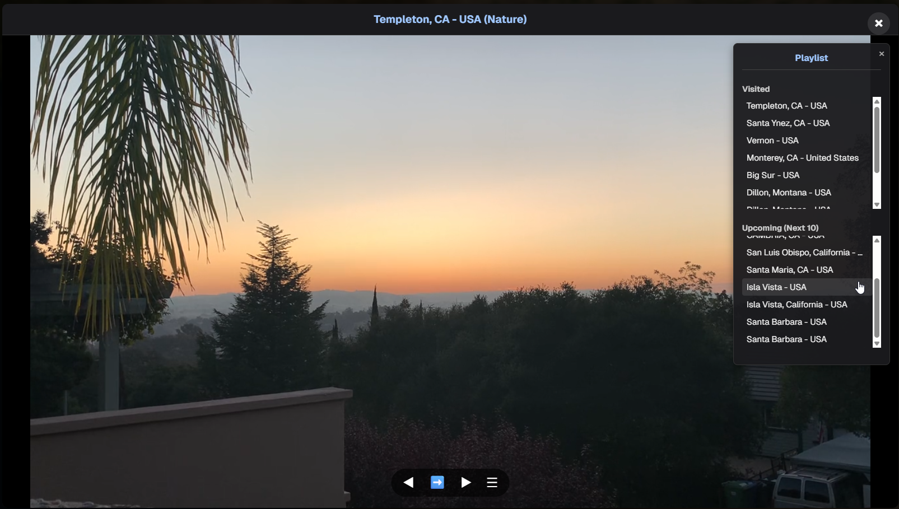

> [!IMPORTANT]
> **Source code only — the video catalog is empty.**
>
> Running this project displays the map and interface, but there are **no video markers or videos to watch**.
>
> Third-party catalogs, personal information and credentials are **not included**. The application does **not automatically fetch the WindowSwap catalog**.
>
> This repository is shared for code review and portfolio purposes. **No ready-to-install application, GitHub Releases, or donation links are provided.**

# Window Swap Desktop

An unofficial Windows desktop prototype for exploring ambient window-view videos on a world map. Built with Electron, Next.js, React, TypeScript, Leaflet and Vimeo embeds. It is not affiliated with, endorsed by, or sponsored by WindowSwap.

## Source-code showcase

This repository is published for source-code review and portfolio purposes. No installers, executable downloads, GitHub Releases, donation links, or paid offering are provided. The video catalog is empty, so this is not a ready-to-use window-view service.

As with any public GitHub repository, visitors can download or fork the source and attempt to build it themselves. Publishing source cannot technically prevent that. This is a source-available showcase, not a project offered under an open-source license. See [Copyright and permissions](#copyright-and-permissions).

## Features

These features are implemented in the source. Video-dependent features require an authorized catalog; they cannot be demonstrated with the default empty catalog.

- Clustered map markers and satellite imagery, with an OpenStreetMap fallback.
- Video playback, looping, previous/next navigation and nearby unvisited videos.
- Viewing history stored locally in localStorage.
- A discovery strip showing recorded videos near the visible map area. These are not live cameras.

## Interface previews

> [!NOTE]
> These screenshots show an earlier prototype with a populated catalog and illustrate its interface. **The public source starts with an empty catalog. The locations and videos shown below are not bundled with the project.**

### World map

Satellite imagery with clustered markers for browsing window-view locations across the world.



### Location selection

A location popup showing the selected place and actions to view its window or open it on Vimeo.



### Video player and playlist

A large video overlay with playback navigation and a side panel separating visited locations from upcoming selections.

The **Upcoming (Next 10)** playlist is generated automatically by a geographic proximity algorithm. Starting from the current video's location, it selects the nearest unvisited location, then repeats the selection from each newly chosen location to build a route of up to ten videos. Previously visited locations and entries already selected for the upcoming playlist are excluded to avoid repeats.



## Catalog and privacy

The shareable source ships with an **empty catalog**. It does not include WindowSwap's catalog, contributor personal information or credentials. The app opens a map without video markers until you supply content you own or have permission to redistribute.

Any catalog added to this client application must be suitable for public sharing. Use only authorized content and public-display locations. Never include personal information, credentials, private locations or private video links. **Bundling information in the application does not keep it confidential.**

Keep private data and build artifacts out of the repository. Run `npm run check:publication` before committing or pushing; this is a publication safeguard, not a complete privacy or security audit. See [the project review](docs/PROJECT_REVIEW.md) for the public source scope.

## Local code review and development

The catalog is empty; the application code is not. These instructions let a reviewer inspect the interface, map and Electron integration locally. They do not restore the historical catalog or provide a ready-to-use video service.

Use Node.js 22 LTS and npm on Windows.

```sh
npm ci
npm run electron:dev
```

For browser development, use `npm run dev`. No environment variable is required by the current code.

```sh
npm run typecheck
npm run check:publication
npm run build
```

The Next.js build exports static files to `out/`. Electron serves them locally through electron-serve. Packaging configuration remains in the source for review, but installer creation and distribution are outside this repository's current publication scope. No installer should be assumed safe to share merely because a build succeeds.

Map imagery, Vimeo playback, the Vimeo player script and some Leaflet assets require internet access. There is no application backend, database, login system, uploader, or real-time camera service.

## Relationship to WindowSwap

This project is independently maintained and is not an official WindowSwap desktop application. There is no collaboration, endorsement or sponsorship by WindowSwap.

This source-only edition contains no WindowSwap catalog and does not automatically collect or refresh one. Some legacy WindowSwap links and product labels remain in the application source; the proposed documentation name does not mean that every application identifier has already been renamed.

This repository does not claim ownership of WindowSwap's service, contributors' videos, or third-party data, and does not assert permission from their rights holders. Any use of third-party content requires the relevant permissions; Vimeo playback does not itself establish rights to another provider's catalog.

The name "Window Swap Desktop" can still suggest an association with WindowSwap. The affiliation statement clarifies the relationship; it is not trademark clearance or a guarantee against a naming dispute. Any future content distribution would require its own rights review.

## Contact

For questions about this prototype, permission requests, or reports concerning rights or privacy, contact Mert Fazla at [mertfazlacontact@gmail.com](mailto:mertfazlacontact@gmail.com) or visit [the maintainer's GitHub profile](https://github.com/mertfazla). Do not post personal information, credentials or private datasets in public issues.

## Copyright and permissions

Copyright (c) 2026 Mert Fazla for original material authored by Mert Fazla. All rights reserved in that material. No project-wide open-source or general reuse license is granted. Contact the maintainer for permission to reuse, redistribute or incorporate that material into another product.

This statement does not restrict rights granted by GitHub's Terms of Service, applicable copyright exceptions, or third-party licenses. Dependencies and any third-party material retain their respective owners' rights and license terms. See [COPYRIGHT.md](COPYRIGHT.md) for the scope of this notice. Public visibility does not mean public-domain ownership, and a copyright notice cannot technically prevent copying.
